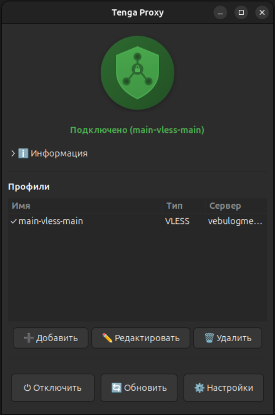
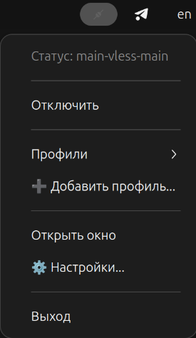

# Tenga Proxy

Клиент прокси для Linux. Использует движок [sing-box](https://github.com/SagerNet/sing-box).

## Поддерживаемые протоколы

- **VLESS** — включая поддержку Reality, XTLS
- **Trojan** — с TLS и без
- **VMess** — V2Ray совместимый
- **Shadowsocks** — включая методы 2022
- **SOCKS4/4a/5** — стандартные прокси
- **HTTP/HTTPS** — HTTP прокси

## Функционал

- Парсинг share links (vless://, trojan://, vmess://, ss://, socks://)
- Импорт подписок (base64, plain text)
- Генерация конфигураций sing-box
- Автоматическая настройка системного прокси (GNOME/KDE)
- Гибкая маршрутизация трафика (через VLESS, VPN или напрямую)
- Управление профилями
- Системный трей с уведомлениями (GTK)
- Мониторинг через Clash API (статистика, соединения)

## Установка

### Быстрая установка

Для сборки и установки/обновления AppImage в систему:

```bash
python cli.py setup
```

- Соберёт AppImage
- Установит его в систему
- Создаст ярлык в меню приложений

После этого приложение будет доступно в меню.

### Установка окружения для разработки

Для разработки и запуска из исходников:

```bash
python cli.py setup-dev
```

- Системные зависимости
- Python venv
- Python зависимости из `requirements.txt`
- Бинарник sing-box

#### Установка sing-box

**Вариант 1: Собрать из исходников**
```bash
# Скачать source code с https://github.com/SagerNet/sing-box/releases
# Собрать бинарник
# Поместить в core/bin/sing-box
chmod +x core/bin/sing-box
```

**Вариант 2: Установить системно**
```bash
# См. официальную документацию: https://sing-box.sagernet.org
```

## Сборка AppImage

Для создания портативного AppImage файла:

### Требования для сборки

- Системные зависимости (устанавливаются через `python cli.py setup-dev`)
- Бинарник `sing-box` в `core/bin/sing-box`

### Сборка

```bash
python cli.py build
```

Результат будет в `dist/tenga-proxy-x.AppImage`.

### Установка AppImage в систему

```bash
python cli.py install
```

После установки "Tenga Proxy" будет доступен в меню приложений.

### Удаление AppImage

```bash
python cli.py install --uninstall
```

### Обновление версии

```bash
# Интерактивный режим
python cli.py bump-version

# С указанием версии
python cli.py bump-version 1.6.0

# С автоматической сборкой после обновления
python cli.py bump-version 1.6.0 --build

# Принудительное обновление (даже если версия совпадает)
python cli.py bump-version 1.6.0 --force
```

## Использование

### CLI

Консольный интерфейс.

#### Парсинг ссылок

```bash
# Парсинг share link с выводом информации
python cli.py parse "vless://..."

# Парсинг с выводом JSON конфигурации для sing-box
python cli.py parse "vless://..." -f json
```

#### Работа с подписками

```bash
# Загрузка и парсинг подписки (список профилей)
python cli.py sub "https://example.com/subscription" 

# Вывод подписки в формате JSON
python cli.py sub "https://example.com/subscription" -f json
```

#### Генерация конфигураций

```bash
# Генерация конфигурации sing-box из share link
python cli.py gen "vless://..." -o config.json

# Генерация с указанием порта прокси
python cli.py gen "vless://..." -p 8080 -o config.json
```

#### Управление профилями

```bash
# Добавить профиль
python cli.py add "vless://..."

# Показать список сохранённых профилей
python cli.py ls

# Удалить профиль по ID
python cli.py rm 1
```

#### Запуск прокси

```bash
# Запустить прокси по share link
python cli.py run "vless://..."

# Запустить прокси по номеру из списка (ls)
python cli.py run 1

# Запустить прокси по ID профиля
python cli.py run 123

# Запустить прокси по имени профиля
python cli.py run "My Profile"

# Запустить на указанном порту (по умолчанию 2080)
python cli.py run 1 -p 8080

# Запустить без автоматической настройки системного прокси
python cli.py run 1 --no-system-proxy

# Запустить из файла (путь к файлу со share link)
python cli.py run /path/to/link.txt
```

#### Информация о версии

```bash
# Показать версию приложения и sing-box
python cli.py ver
```

#### Сборка и установка

```bash
# Собрать и установить AppImage
python cli.py setup

# Только собрать AppImage
python cli.py build

# Установить AppImage в систему
python cli.py install

# Удалить AppImage из системы
python cli.py install --uninstall

# Установить окружение для разработки
python cli.py setup-dev

# Обновить версию проекта
python cli.py bump-version 1.6.0
```

#### Справка

```bash
# Показать общую справку
python cli.py --help

# Показать справку по конкретной команде
python cli.py run --help
python cli.py parse --help
python cli.py build --help
```

### GUI

```bash
python gui.py
```

- Системный трей с быстрым подключением/отключением
- Управление профилями
- Настройки DNS, VPN и маршрутов
- Статистика подключений и задержки



*Основное окно*



*Контекстное меню в системном трее*

### Быстрый запуск прокси

```bash
# 1. Добавить профиль из share link
python cli.py add "vless://..."

# 2. Просмотреть список профилей
python cli.py ls

# 3. Запустить прокси (по порядковому номеру из списка)
python cli.py run 1

# 4. Проверить работу прокси
curl -x socks5://127.0.0.1:2080 https://ifconfig.me
curl -x http://127.0.0.1:2080 https://ifconfig.me

# 5. Остановить прокси: нажмите Ctrl+C
```

**Примечание:** По умолчанию CLI автоматически настраивает системный прокси. Если нужно запустить только локальный прокси без изменения системных настроек, используйте флаг `--no-system-proxy`.

## Зависимости

### Требования для CLI

Для работы CLI требуются:

- Python 3.8+
- Модуль `requests` (для загрузки подписок)
- Бинарник `sing-box` (для запуска прокси)

**Минимальная установка для CLI:**

```bash
pip3 install requests
```

Или установите все зависимости из `requirements.txt`:

```bash
pip3 install -r requirements.txt
```

### Требования для GUI/AppImage

AppImage использует системный Python3 и требует установленных зависимостей.

#### Системные пакеты (Ubuntu/Debian)

```bash
sudo apt update
sudo apt install -y \
    python3 \
    python3-gi \
    python3-pip \
    gir1.2-gtk-3.0 \
    gir1.2-appindicator3-0.1 \
    gir1.2-notify-0.7 \
    libfuse2t64
```

#### Python пакеты

```bash
pip3 install requests PyYAML PyGObject
```

Или установите все зависимости из `requirements.txt`:

```bash
pip3 install -r requirements.txt
```

### Требования для sing-box

CLI и GUI требуют наличия бинарника `sing-box`. Он может быть:

1. **В директории проекта:** `core/bin/sing-box`
2. **В системном PATH:** установлен системно
3. **В AppImage:** встроен в образ

Если `sing-box` не найден, CLI покажет инструкции по установке при попытке запуска прокси.
