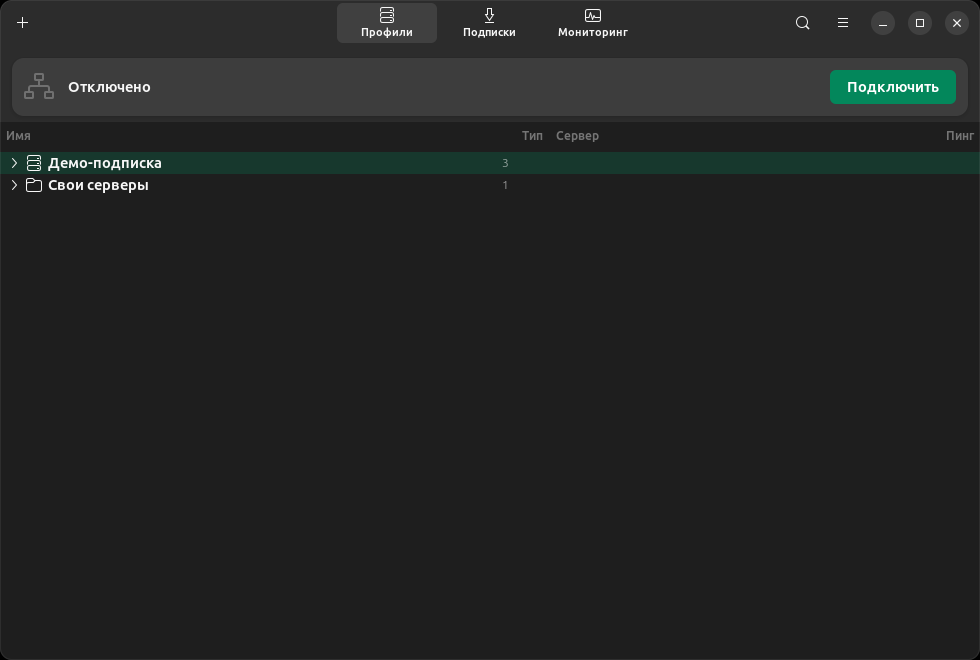
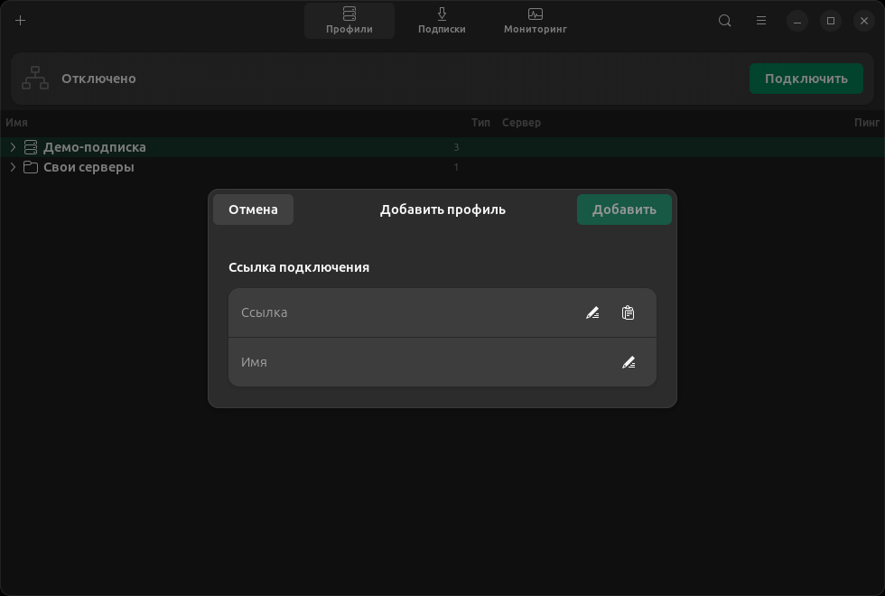
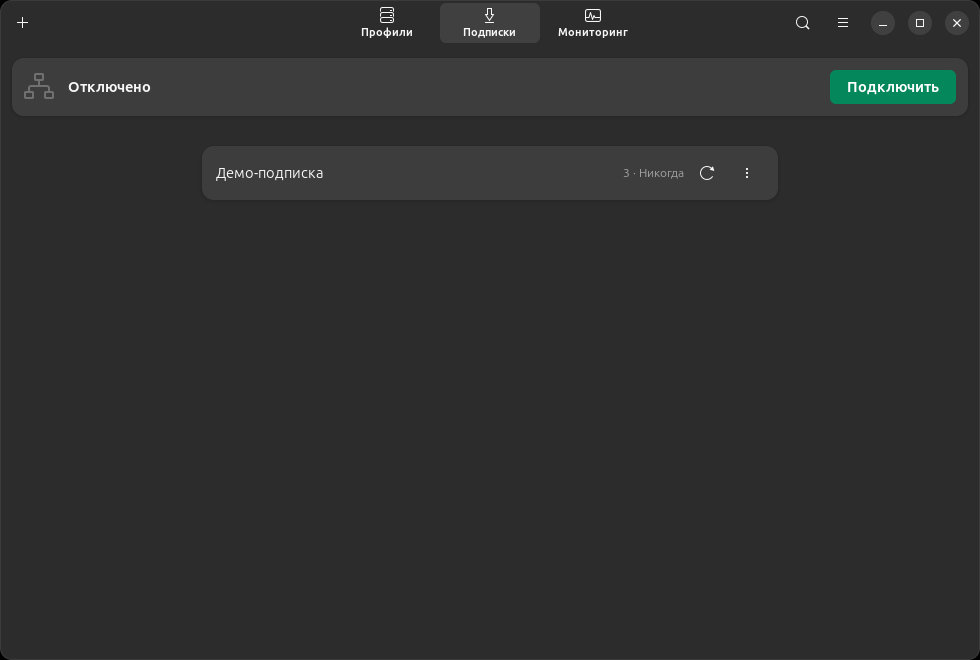
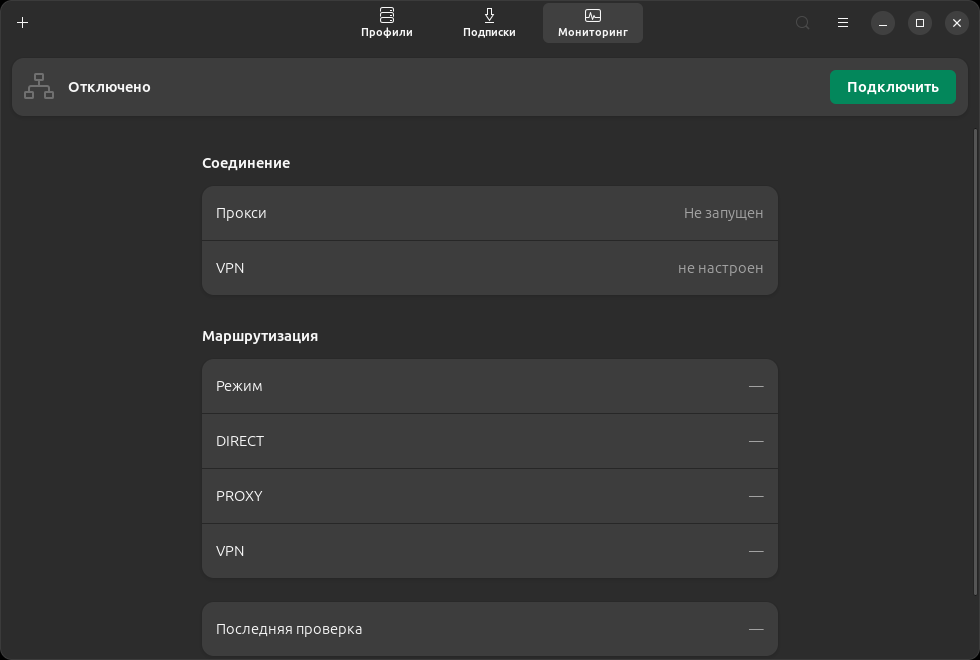

<div align="center">


# Tenga Proxy

Прокси-клиент для Linux с движком [xray-core](https://github.com/XTLS/Xray-core)

</div>



## Что это

Приложение для подключения к прокси-серверам. Понимает ссылки вида
`vless://`, `trojan://`, `vmess://`, `ss://` и подписки, умеет пускать через
прокси весь трафик системы или только выбранные сайты.

Интерфейс написан на GTK 4 и libadwaita, поэтому выглядит как обычное
приложение GNOME и подхватывает светлую или тёмную тему из настроек системы.

## Возможности

- **Протоколы:** VLESS (включая Reality и XTLS), Trojan, VMess,
  Shadowsocks (включая методы 2022), Hysteria2, SOCKS, HTTP
- **Подписки** — импорт списка серверов по ссылке, обновление одной кнопкой
- **Два режима работы** — TUN (весь трафик системы, как у VPN) или
  системный прокси (GNOME/KDE настраиваются автоматически)
- **Гибкая маршрутизация** — отдельные правила для доменов и подсетей:
  напрямую, через прокси или через VPN
- **Замер задержки** до серверов, чтобы выбрать самый быстрый
- **Выбор DNS** — Google, Cloudflare, AdGuard или свой сервер; запросы
  можно пускать через прокси
- **Системный трей** — подключение и смена сервера без открытия окна
- **Мониторинг** — состояние соединения, VPN и активных правил

## Установка

Скачайте AppImage со страницы
[Releases](https://github.com/vebulogmetra/tenga-proxy/releases),
сделайте файл исполняемым и запустите:

```bash
chmod +x tenga-proxy-*.AppImage
./tenga-proxy-*.AppImage
```

Чтобы приложение появилось в меню, скопируйте AppImage в `~/.local/bin`
и создайте ярлык — или соберите и установите его командами из
[документации](docs/ru/installation.md).

### Что нужно в системе

Ubuntu 24.04, Fedora 40, Debian 13 и новее подходят без настройки. На более
старых дистрибутивах нужна libadwaita 1.5 или новее.

```bash
sudo apt install python3-gi gir1.2-gtk-4.0 gir1.2-adw-1 libfuse2t64
```

Для режима TUN нужны права на создание сетевого интерфейса — приложение
запросит их при первом включении.

## Как пользоваться

### Добавить сервер

Нажмите **＋** в шапке окна и вставьте ссылку подключения. Приложение
разберёт её само: имя, адрес и протокол заполнятся автоматически.



Если у вас есть ссылка на подписку, выберите **＋ → Подписка** — список
серверов загрузится целиком и будет обновляться по кнопке.



### Подключиться

Выберите сервер в списке и нажмите **Подключить**. Двойной клик по строке
подключает сразу.

Колонка **Пинг** показывает задержку до сервера. Чтобы измерить её у всех
сразу, нажмите `Ctrl+T`.

### Проверить состояние

Вкладка **Мониторинг** показывает, работает ли прокси, поднят ли VPN и какие
правила маршрутизации сейчас действуют.



### Работать из трея

Иконка в трее меняется в зависимости от состояния: перечёркнутый круг —
отключено, пунктирное кольцо — идёт подключение, залитый круг — подключено.
Через её меню можно сменить сервер или отключиться, не открывая окно.

В GNOME для значков в трее нужно расширение
[AppIndicator and KStatusNotifierItem Support](https://extensions.gnome.org/extension/615/appindicator-support/).
Без него приложение работает как обычно, просто без иконки в панели.

## Сочетания клавиш

| Сочетание | Действие |
|-----------|----------|
| `Ctrl+Return` | Подключить или отключить |
| `Ctrl+T` | Проверить задержку |
| `Ctrl+N` | Добавить профиль |
| `Ctrl+Shift+N` | Добавить подписку |
| `F5` | Обновить подписки |
| `Ctrl+F` | Поиск по списку |
| `Ctrl+,` | Настройки |
| `Ctrl+W` | Скрыть окно |
| `Ctrl+Q` | Выход |

## Режимы работы

**TUN** (по умолчанию) — приложение поднимает виртуальный сетевой интерфейс,
и через прокси идёт весь трафик системы, включая программы, которые не умеют
работать с прокси.

**Системный прокси** — приложение поднимает локальный SOCKS и HTTP прокси и
прописывает его в настройки рабочего стола. Трафик пойдёт только у программ,
которые эти настройки читают.

Режим переключается в **Настройках → Общие**.

## Командная строка

У проекта есть и консольный интерфейс — он пригодится на сервере без
графики или в скриптах. Работает при запуске из исходников:

```bash
# Добавить профиль и посмотреть список
python cli.py add "vless://..."
python cli.py ls

# Запустить прокси по номеру из списка
python cli.py run 1

# Проверить, что трафик идёт через прокси
curl -x socks5://127.0.0.1:2080 https://ifconfig.me
```

Полный список команд — в [документации](docs/ru/cli.md).

## Документация

- [Обзор возможностей](docs/ru/overview.md)
- [Установка](docs/ru/installation.md)
- [Графический интерфейс](docs/ru/gui.md)
- [Профили и подписки](docs/ru/profiles.md)
- [Протоколы](docs/ru/protocols.md)
- [Маршрутизация](docs/ru/routing.md)
- [VPN](docs/ru/vpn.md)
- [Командная строка](docs/ru/cli.md)

Разработчикам: [сборка и участие в проекте](docs/ru/development.md).

## Лицензия

[MIT](LICENSE)

